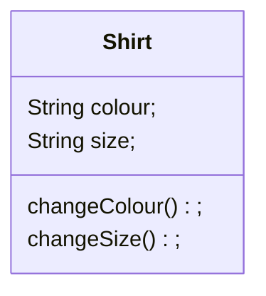

# Lesson-2

## What is Object-Oriented Programming (OOP)?

- OOP is about using multiple code files to make it easier to structure and understand your code.
- Although we will have multiple code files, we will only run one. Why and How?
- What other code files will do is act as a blueprint for an object that you will create in the main code file.
  - These code files will structure the objects properties and behaviour.
- In the main code file you will create these objects and manipulate it to make it behave how you would want it to.
>***NOTE*** : You can think of it as making your own math/physics formula and adding different numbers to it in the main file.
> 
> Or you can think of it as creating a T-Shirt, you define what a T-Shirt should have. Then, everytime time you make a T-Shirt object you can change its size, colour, or add a graphic design.
> (Hence each T-Shirt will have its own properties)



For Example:
```java 
public class Shirt(){
    
    public Shirt(){}
}
```
