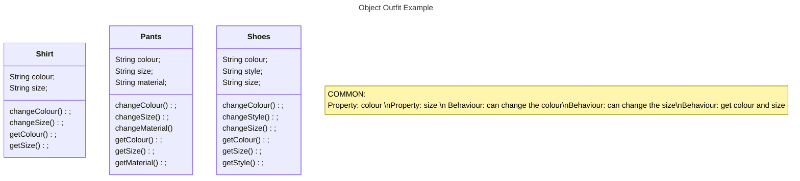

# Lesson-2

## What is Object-Oriented Programming (OOP)?
OOP is about using multiple code files to make it easier to structure and understand your code.
Although we will have multiple code files, we will only run one.

**_Why is this the case? How is this done?_**

- What other code files will do is act as a blueprint for an object that you will create in the main code file.
  - These code files will structure the objects properties and behaviour.
- In the main code file you will create these objects and manipulate it to make it behave how you would want it to.
>***NOTE*** : You can think of it as creating a T-Shirt, you define what a T-Shirt should have. Then, everytime time you make a T-Shirt object you can change its size, colour, or add a graphic design.
> Due to this,  each T-Shirt will have a unique size, colour, and/or graphic.



Shirt Code Example:
```java 
class Shirt {
  // Stating Default Properties/Attributes of the Shirt object
  String colour;
  String size;

  // Constructor
  public Shirt(String colour, String size){
    this.colour = colour;
    this.colour = size;
  }


  // Behaviours/Functions of the Shirt
  public void changeColour(String colour1){
    colour = colour1;
  }

  public void changeSize(String size1){
    size = size1;
  }

  public String getColour(){
    return colour;
  }

}
```
- In this public class, we have stated the properties of a shirt and its functions.
  - All functions except for `getColour()` are `void`, meaning it will not return a datatype value. 
  - Since no functions are `static`, we will need an object to call them.

Now let's create a shirt object for a class called `Human`:
```java
class Human {
  String name;
  Shirt shirt;

  public Human(String name, Shirt shirt){
    this.name = name;
    this.shirt = shirt;
  }

  public void changeColourForAllClothes(String colour){
    shirt.changeColour(colour);

    System.out.println("Shirt colour: "+shirt.getColour());
  }
}
```
>***NOTE*** : Although this example only includes `Shirt` classes, you can add other classes (like the `Pants` class) by following the same process as shown above. 

Now let's create a `Human` and `Shirt` class in our main file:

```java
public class Main {
  public static void main(String[] args){
    Shirt shirt1 = new Shirt("White", "Large");
    Human human1 = new Human("Tom", shirt1);

    human1.changeColourForAllClothes("Red");
  }
}
```

- What we have done here is create a `Shirt` object that has attributes and functions.
- We then used the `Shirt` object as a parameter for the `Human` class and its functions.
- Lastly, in the main file, we defined a `Shirt` object and placed it in the `Human` object.

## How does this tie into FTC code?

As you may know, FTC does not allow humans to compete in competitions.
How would this apply to our robotics team?

Every year, the (amazing!) design and build subteams creates a robot consisting of multiple section.
There usually is a drivetrain, a claw, and a way to lift game objects.
`Drivetrain`, `Claw`, and `Lift` classes can be created for each section of the robot.

Additionally, you'll want to create different programs for testing out concepts and debugging programs.
As a result, you'll want different Main classes like `TankDrive2p` or `ServoValueFinder`
  to implement different classes and use each class in different ways. 

To see how this can be applied, check out TeamCode/src/main/java/org.firstinspires.ftc.teamcode.
In there, a `Core` and `Drive` folder separates classes meant to be implemented
  and classes intending to be run through the driver hub.